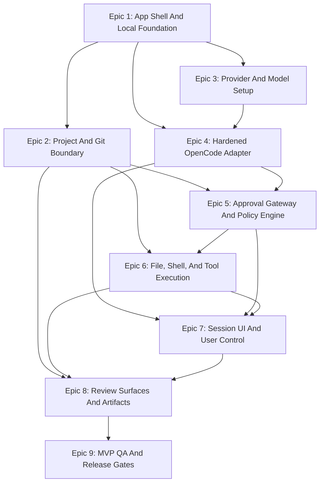

# Epic Dependencies

## Dependency Graph

## Critical Path

1. Epic 1: App Shell And Local Foundation.
2. Epic 3: Provider And Model Setup.
3. Epic 4: Hardened OpenCode Adapter.
4. Epic 5: Approval Gateway And Policy Engine.
5. Epic 6: File, Shell, And Tool Execution.
6. Epic 7: Session UI And User Control.
7. Epic 8: Review Surfaces And Artifacts.
8. Epic 9: MVP QA And Release Gates.

Epic 2 should run immediately after Epic 1 because project-root path resolution
is needed by approval policy, shell working-directory policy, Git display, and
file access.

## Dependency Rules

- No runtime tool execution before project-root path resolution exists.
- No protected action execution before Approval Gateway exists.
- No model-backed session before OpenRouter credential reference capture exists.
- No OpenCode-backed session start before instruction-source disclosure exists.
- No public MVP release before Tauri app-build validation and product QA pass.
