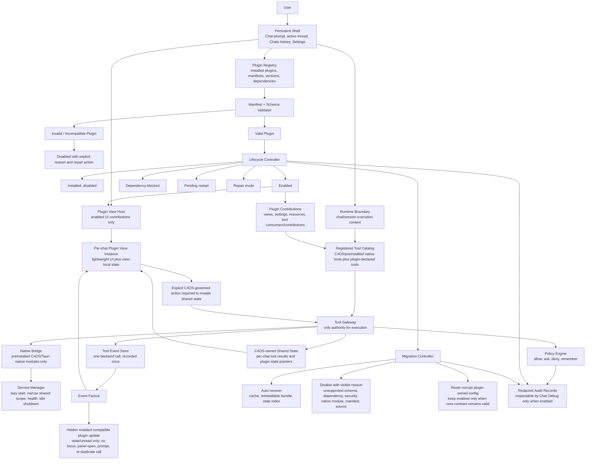

# Shell Plugin Architecture Model

Status: proposed

## Resolved Architecture Model

This spec uses the following authorities and boundaries for the shell/plugin
architecture. This is a decomposition of accepted decisions, not a new product
scope expansion.

## Glossary

| Term | Meaning |
| --- | --- |
| Persistent Shell | The C4OS-owned frame: chat prompt, active thread, user-global Chats history, Settings entry, and plugin placement surface. |
| C4OS app plugin | A Codex-compatible plugin bundle with optional C4OS app-shell contributions declared in `agents/c4os.yaml`. It is not a Tauri plugin. |
| Tauri/native module | A preinstalled C4OS/Tauri backend capability. Marketplace plugins may bind to these modules but do not introduce arbitrary native backend modules at runtime. |
| Plugin Registry | The C4OS-owned inventory of installed plugin bundles, manifest versions, dependency status, lifecycle state, marketplace source, and repair state. |
| Lifecycle Controller | The C4OS authority that moves plugins between installed-disabled, enabled, dependency-blocked, pending-restart, repair, and disabled states. |
| Manifest Validator | The schema and compatibility gate for `plugin.json` plus `agents/c4os.yaml`; invalid declarations produce visible disabled or repairable states before shell layout or tool authority is applied. |
| Plugin View Host | The frontend host that renders enabled plugin panel contributions. It does not own backend authority or shared tool-result state. |
| Plugin View Instance | A per-chat lightweight UI/view-state instance. It may hydrate from C4OS-owned shared state and keep view-local UI state. |
| Registered Tool Catalog | The C4OS-owned list of callable registered tools, including preinstalled native tools and plugin-declared tools. Runtime discovery is not limited to visible or enabled plugin views. |
| Tool Gateway | The only execution authority for runtime tools and plugin-contributed tools. It applies policy, records events, and owns shared result state. |
| Policy Engine | The approval authority for allow, ask, deny, and remember decisions. Plugins may request narrower defaults, but C4OS owns default and maximum authority. |
| Service Manager | The C4OS authority for heavy plugin services: lazy start, narrow shared lifecycle scope, health/activity state, idle shutdown, disable/uninstall shutdown, and app-exit shutdown. |
| Shared State | C4OS-owned per-chat result and inspectable state from tool calls. Plugin views can hydrate from it but cannot claim, mutate, or delete it except through explicit C4OS-governed actions. |
| Event Fanout | The C4OS event-delivery path for one recorded backend tool event to all compatible enabled views, visible or hidden, without duplicate backend invocation. |
| Migration Controller | The C4OS authority for migration failure classification, auto-recovery, reset, disablement, and repair surfacing. |
| Redacted Audit Records | C4OS-owned execution/lifecycle/debug records. Chat Debug may display them only when enabled and must preserve redaction/no-export rules. |

## Lifecycle State Machine

| State | Entry Condition | Allowed Next States | User Surface |
| --- | --- | --- | --- |
| Installed, disabled | Bundled/default or user-installed plugin exists but is not enabled. Built-ins enter here by default. | Enabled, uninstalled, incompatible/disabled with reason. | Settings > Plugins shows disabled state and enable action when valid. |
| Enabled | Manifest is valid, required dependencies are present/enabled, policy permits contributions, and no restart-gated backend change is pending for required capability. | Disabled, dependency-blocked, pending-restart, repair mode, uninstalled. | Plugin contributions may appear in shell, prompt resources, and tool catalog according to declarations. |
| Dependency-blocked | Required app plugin, native module, heavy service, or C4OS capability/tool identity is missing or disabled. | Enabled after dependency repair, disabled, uninstalled. | Settings > Plugins shows blocked reason and dependency repair path. |
| Pending restart | UI/settings changes can apply live, but native backend registration or removal requires app restart. | Enabled after restart, disabled, uninstalled. | Affected tools/surfaces show restart-required reason; newly contributed backend tools stay unavailable until restart. |
| Repair mode | Plugin remains inspectable but one or more declarations, config values, cache entries, or marketplace records need user-visible repair. | Enabled, disabled with reason, uninstalled. | Settings > Plugins shows repair action and reason. |
| Disabled with reason | Validator, migration, dependency, security, native-module, manifest, or marketplace-source failure prevents safe enablement. | Repair mode, installed-disabled after fix, uninstalled. | Settings > Plugins shows disabled reason and repair/remove actions. |
| Uninstalled | Installed cache copy removed. Built-in/default plugins can be reinstalled from bundled/default marketplace; user plugins from their marketplace source when available. | Installed-disabled after reinstall. | Uninstall prompts whether to delete plugin-owned user data. |

## Migration Failure Classification

| Failure Class | Recovery Path | Resulting State |
| --- | --- | --- |
| Cache failure | Auto-recover cache or rebuild local installed-cache record when source remains valid. | Previous state if recovery succeeds; repair mode if it fails. |
| Reinstallable bundle failure | Auto-reinstall from bundled/default or reachable marketplace source. | Installed-disabled or enabled according to prior valid lifecycle state after validation. |
| Stale index failure | Auto-refresh marketplace/index metadata when source remains valid. | Previous state if validation passes; repair mode if source cannot be resolved. |
| Corrupt plugin-owned user config | Reset corrupt plugin-owned config automatically only when manifest and dependencies remain valid. | Enabled with reset config and visible notice. |
| Unsupported `agents/c4os.yaml` schemaVersion | Do not auto-recover. | Disabled with visible incompatible-schema reason. |
| Missing or disabled dependency | Do not auto-recover. | Dependency-blocked with repair path. |
| Security policy violation | Do not auto-recover. | Disabled with security reason. |
| Unavailable required preinstalled native module | Do not auto-recover. | Disabled or dependency-blocked with native-module reason. |
| Invalid or unreadable plugin manifest | Do not auto-recover. | Disabled with manifest reason. |
| Missing marketplace source or non-reinstallable plugin bundle | Do not auto-recover. | Disabled or repair mode with source/relink/remove action. |
